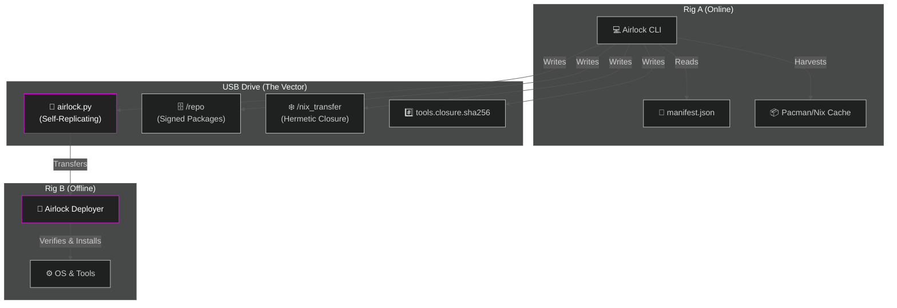
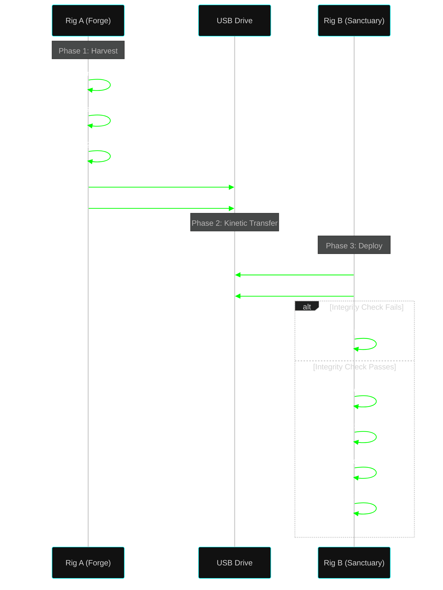

# ⟁ AIRLOCK

```text
      /=\
     | = |    THE PROTOCOL FOR
      \=/     SOVEREIGN STATE SYNCHRONIZATION
```


> ✨ "Entropy is the enemy. Air-gaps are the terrain. Airlock is the bridge."

## 🏛️ The Philosophy (Telos)

Airlock is not a script; it is a **Protocol**.

In an era of supply chain attacks, surveillance, and dependency drift, the only safe computer is an air-gapped computer. But air-gaps usually mean stagnation. Systems rot because updating them is painful.

**Airlock solves the "Air-Gap Paradox."**

It treats the USB drive not as storage, but as a **Kinetic State Vector**. It enforces **Atomic State Synchronization** between a connected "Forge" (Rig A) and a secure "Sanctuary" (Rig B). It uses Merkle Trees (Nix) and Cryptographic Chains of Custody (Pacman) to ensure that the state of the Sanctuary is mathematically identical to the intent of the Forge.

No drift. No partial upgrades. No internet required.

---

## 🗺️ The Architecture (Logos)

We utilize the **C4 Model** to visualize the system at four levels of abstraction.

### Level 1: System Context
*The flow of Gnosis (Knowledge) from the World to the Sanctuary.*

```mermaid
%%{init: {'theme': 'dark', 'themeVariables': { 'primaryColor': '#111', 'primaryTextColor': '#0ff', 'lineColor': '#0ff', 'secondaryColor': '#333', 'tertiaryColor': '#222' }}}%%
graph LR
    World((☁️ The Internet))
    User((👤 The Architect))
    
    subgraph "The Airlock Protocol"
        RigA[("🖥️ Rig A\n(The Forge)")]
        USB[("💾 The Kinetic Bridge\n(LUKS Encrypted)")]
        RigB[("🛡️ Rig B\n(The Sanctuary)")]
    end

    World -- "Packages & Updates" --> RigA
    User -- "Defines Manifest" --> RigA
    RigA -- "Harvests & Signs" --> USB
    USB -- "Physical Transfer" --> RigB
    RigB -- "Deploys & Verifies" --> RigB

    classDef forge fill:#111,stroke:#0ff,stroke-width:2px;
    classDef bridge fill:#222,stroke:#f0f,stroke-width:2px,stroke-dasharray: 5 5;
    classDef sanctuary fill:#000,stroke:#0f0,stroke-width:4px;
    
    class RigA forge;
    class USB bridge;
    class RigB sanctuary;
```



### Level 2: Container Diagram
*The physical boundaries of the data and execution.*



### Level 3: Component Diagram
*The internal logic of the airlock.py engine.*

```mermaid
%%{init: {'theme': 'dark', 'themeVariables': { 'primaryColor': '#111', 'primaryTextColor': '#ddd', 'lineColor': '#0ff' }}}%%
graph TD
    subgraph "Airlock Engine"
        HAL["🔌 Hardware Abstraction Layer\n(Auto-Mount / LUKS)"]
        
        subgraph "Harvest Mode"
            PacmanHarvester["📦 Pacman Harvester"]
            NixHarvester["❄️ Nix Harvester"]
            Signer["✍️ Cryptographic Signer"]
        end
        
        subgraph "Deploy Mode"
            Verifier["🛡️ Integrity Verifier\n(SHA256 / GPG)"]
            Installer["⚙️ Atomic Installer"]
            Policy["📜 Security Policy\n(USBGuard / ClamAV)"]
        end
        
        TUI["🖥️ Rich TUI\n(Visual Feedback)"]
    end

    HAL --> TUI
    TUI --> PacmanHarvester & NixHarvester
    PacmanHarvester & NixHarvester --> Signer
    
    TUI --> Verifier
    Verifier --> Installer
    Installer --> Policy

    classDef core fill:#000,stroke:#0ff,stroke-width:2px;
    class HAL,TUI core;
```



### Level 4: The Flow (Sequence)
*The "Nuke and Pave" Lifecycle.*



---

## ⚡ The Praxis (Quick Start)

### 1. The Forge (Rig A - Online)
*Prepare the vector.*

```bash
# 1. Clone the Protocol
git clone https://github.com/your-username/airlock.git
cd airlock

# 2. Define your Reality (Edit manifest.json)
# Add your tools: "docker", "go", "obs-studio", "vscodium"

# 3. Insert USB & Harvest
sudo ./airlock.py --mode harvest --config manifest.json
```

### 2. The Sanctuary (Rig B - Offline)
*Apply the state.*

```bash
# 1. Insert USB
# 2. Execute the Protocol
sudo /run/media/user/AIRLOCK/airlock.py --mode deploy
```

---

## 🛡️ The Assurance (Security)

Airlock is built on the **Zero Trust** principle.

*   **Hardware Abstraction:** It auto-detects block devices. It refuses to run if multiple drives introduce ambiguity.
*   **Cryptographic Integrity:** It generates SHA256 hashes of the payload on Rig A and verifies them on Rig B before a single byte is installed.
*   **Atomic Operations:** Updates are transactional. The system is never left in a broken state.
*   **Perimeter Defense:** It automatically configures **USBGuard** to whitelist only the specific peripherals present at deployment, locking the door behind it.

---

## 📦 The Manifest

Your `manifest.json` is the DNA of your system.

```json
{
    "comment": "The Sovereign Developer Stack",
    "pacman_packages": [
        "git", "docker", "base-devel", "clamav", "usbguard"
    ],
    "nix_packages": [
        "vscodium", "postman", "obs-studio", "python311", "go"
    ]
}
```
